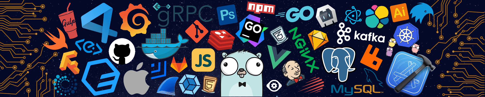

<!-- Header -->

  

**`Digital Craftsman`**

<!-- 
 -->

---

### About

I'm an **undergrad** pursuing my B.E. in **Computer Engineering** at **Vishwakarma Government Engineering College**, Ahmedabad, India — **Jack of all Trades Crafting Intelligent and Autonomous systems that solve real-world problems.**

- Building **[GitDecode](https://gitdecode.app)** — AI Codebase Intelligence
- Building **[AgenticPilot](https:agenticpilot.vercel.app)** — AI Automation Platform
- Specializing in **Generative AI**, **Agentic AI**, **Machine Learning**, **Deep Learning** and **Cloud Computing**
- Explore my Portfolio: **[Priyanshu-Debugs](https://priyaanshu.vercel.app)**

 

---

### Languages

  

---

### Libraries & Frameworks

  
  
  
  
  
  
  
  
  
  

---

### Tools

  

---

### Connect Me

  
  
  
  

---

### Contribution

  
<picture>
  <source media="(prefers-color-scheme: dark)" srcset="https://raw.githubusercontent.com/Priyanshu-Debugs/Priyanshu-Debugs/output/github-snake-dark.svg" />
  <source media="(prefers-color-scheme: light)" srcset="https://raw.githubusercontent.com/Priyanshu-Debugs/Priyanshu-Debugs/output/github-snake.svg" />
  
</picture>

  
---

  <h3>
    <i>"A Jack of all Trades is a Master of None, but oftentimes Better than a Master of One."</i>
  </h3>

  
  Stay Curious and Never Settle
  

